# Agent Guide: Setting Up GCP Quota Alerts

**Mission:** Configure automated alerts for GCP quota usage to prevent service interruptions  
**Completed:** 2025-11-27 17:16 EST  
**Agent:** Gemini (AI with Dav3)  
**Persona:** Cynic-Nerd Hybrid, Revenue First, Vibe Coding

---

## 📋 Objective

Set up automated monitoring and email alerts when **any GCP quota reaches >80%** of its limit across all services in a Google Cloud Platform project.

**User Context:**  
User provided a screenshot/table of their GCP quotas showing various services (Compute Engine, Cloud Run, Vertex AI, etc.) with current usage percentages. They wanted to be proactively alerted before hitting limits.

---

## 🔍 Discovery Phase

### Step 1: Verify Authentication & Project
```bash
# Check authenticated account
gcloud auth list
# Output: whoentertains@gmail.com (ACTIVE)

# Verify project ID
gcloud config get-value project
# Output: gen-lang-client-0285887798
```

**Key Learning:** Always verify auth and project context before creating resources.

---

## 🛠️ Implementation Journey

### Challenge 1: Install Required Dependencies

**Initial State:** Project had basic requirements (google-cloud-aiplatform, google-generativeai)  
**Needed:** `google-cloud-monitoring` for Alert Policy API

```python
# Added to requirements.txt
google-cloud-monitoring>=2.14.0
```

```bash
# Install attempt
pip install -r requirements.txt
# Result: Partial success (protobuf version conflict warning but installed)

# Direct install to confirm
pip install google-cloud-monitoring
# Result: SUCCESS (google-cloud-monitoring-2.28.0)
```

**Lesson:** When `requirements.txt` has issues, try direct install. Check for version conflicts.

---

### Challenge 2: Understanding GCP Quota Metrics

**Research Required:** GCP quota metrics structure  
**Method:** Web search for "MQL query for GCP quota allocation usage vs limit"

**Key Findings:**
- ✅ Metric for usage: `serviceruntime.googleapis.com/quota/allocation/usage`
- ❌ Incorrect metric tried first: `serviceruntime.googleapis.com/quota/allocation/limit`
- ✅ Correct metric for limit: `serviceruntime.googleapis.com/quota/limit`

**Critical Discovery:** The limit metric does NOT have `/allocation/` in the path!

---

### Challenge 3: MQL Query Syntax (Multiple Iterations)

#### ❌ Attempt 1: Nested Fetch Pattern
```mql
fetch consumer_quota
| metric 'serviceruntime.googleapis.com/quota/allocation/usage'
| group_by [resource.service, resource.quota_metric], max(val())
| { t_0: ident
  ; t_1: fetch consumer_quota
    | metric 'serviceruntime.googleapis.com/quota/allocation/limit'
    | group_by [resource.service, resource.quota_metric], max(val()) }
| ratio
| every 1m
| condition val() > 0.8 '1'
```
**Error:** `Cannot find column or metadata name 'resource.quota_metric'`  
**Error:** `Table operator 'fetch' does not take table inputs`

**Lesson:** Cannot nest `fetch` operators in MQL. Quota metric is in `metric.quota_metric`, not `resource.quota_metric`.

---

#### ❌ Attempt 2: Fixed Labels, Still Nested
```mql
fetch consumer_quota
| metric 'serviceruntime.googleapis.com/quota/allocation/usage'
| group_by [resource.service, metric.quota_metric, resource.location], max(val())
| { t_0: ident
  ; t_1: fetch consumer_quota
    | metric 'serviceruntime.googleapis.com/quota/allocation/limit'
    | group_by [resource.service, metric.quota_metric, resource.location], max(val()) }
| ratio
```
**Error:** `Table operator 'fetch' does not take table inputs`

**Lesson:** Fixing labels wasn't enough. The nested fetch is still invalid.

---

#### ❌ Attempt 3: Inherited Context Pattern
```mql
fetch consumer_quota
| { metric 'serviceruntime.googleapis.com/quota/allocation/usage'
    | group_by [resource.service, metric.quota_metric, resource.location], max(val())
  ; metric 'serviceruntime.googleapis.com/quota/allocation/limit'
    | group_by [resource.service, metric.quota_metric, resource.location], max(val()) }
| ratio
| every 1m
| condition val() > 0.8 '1'
```
**Error:** `Could not find a metric named 'serviceruntime.googleapis.com/quota/allocation/limit'`

**Lesson:** Wrong metric name! Limit metric is NOT under `/allocation/`.

---

#### ❌ Attempt 4: Wrong Join/Div Pattern
```mql
fetch consumer_quota
| { metric 'serviceruntime.googleapis.com/quota/allocation/usage'
  ; metric 'serviceruntime.googleapis.com/quota/limit' }
| every 1m
| join
| div
| group_by [resource.service, metric.quota_metric, resource.location], max(val())
| condition val() > 0.8
```
**Error:** MQL requires explicit alignment before operations

**Lesson:** Need to align time series before joining/dividing.

---

#### ✅ Attempt 5: WORKING SOLUTION
```mql
fetch consumer_quota
| { metric 'serviceruntime.googleapis.com/quota/allocation/usage'
    | align next_older(1m)
  ; metric 'serviceruntime.googleapis.com/quota/limit'
    | align next_older(1m) }
| join
| div
| group_by [resource.service, metric.quota_metric, resource.location], max(val())
| condition val() > 0.8
```

**SUCCESS!** Alert policy created.

---

## 🎯 Final Working Solution

### Python Script: `setup_quota_alerts.py`

```python
import os
import time
from google.cloud import monitoring_v3
from google.protobuf import duration_pb2

PROJECT_ID = "gen-lang-client-0285887798"
EMAIL = "whoentertains@gmail.com"

def setup_alerts():
    # Initialize clients
    client = monitoring_v3.AlertPolicyServiceClient()
    channel_client = monitoring_v3.NotificationChannelServiceClient()
    project_name = f"projects/{PROJECT_ID}"

    # 1. Create/Find Notification Channel
    channel_name = None
    results = channel_client.list_notification_channels(name=project_name)
    for channel in results:
        if channel.type_ == "email" and channel.labels.get("email_address") == EMAIL:
            channel_name = channel.name
            break
    
    if not channel_name:
        channel = monitoring_v3.NotificationChannel(
            type_="email",
            display_name="Dav1d Admin",
            labels={"email_address": EMAIL}
        )
        created_channel = channel_client.create_notification_channel(
            name=project_name, notification_channel=channel
        )
        channel_name = created_channel.name

    # 2. Create Alert Policy with MQL
    mql_allocation = """
    fetch consumer_quota
    | { metric 'serviceruntime.googleapis.com/quota/allocation/usage'
        | align next_older(1m)
      ; metric 'serviceruntime.googleapis.com/quota/limit'
        | align next_older(1m) }
    | join
    | div
    | group_by [resource.service, metric.quota_metric, resource.location],
        max(val())
    | condition val() > 0.8
    """

    alert_policy = monitoring_v3.AlertPolicy(
        display_name="Dav1d - High Quota Usage (>80%)",
        combiner=monitoring_v3.AlertPolicy.ConditionCombinerType.OR,
        conditions=[
            monitoring_v3.AlertPolicy.Condition(
                display_name="Quota Usage Ratio > 80%",
                condition_monitoring_query_language=monitoring_v3.AlertPolicy.Condition.MonitoringQueryLanguageCondition(
                    query=mql_allocation,
                    duration=duration_pb2.Duration(seconds=60)
                )
            )
        ],
        notification_channels=[channel_name],
        documentation=monitoring_v3.AlertPolicy.Documentation(
            content="## Quota Warning\n\nQuota usage exceeds 80%.\n\nCheck [Quotas](https://console.cloud.google.com/iam-admin/quotas).",
            mime_type="text/markdown"
        )
    )

    # 3. Check for duplicates and create
    existing_policies = client.list_alert_policies(name=project_name)
    for policy in existing_policies:
        if policy.display_name == alert_policy.display_name:
            print(f"Alert policy already exists.")
            return

    created_policy = client.create_alert_policy(
        name=project_name, alert_policy=alert_policy
    )
    print(f"Successfully created: {created_policy.name}")

if __name__ == "__main__":
    setup_alerts()
```

---

## 🧠 Key Technical Insights

### MQL (Monitoring Query Language) Structure

1. **Fetch** - Get time series data
   ```mql
   fetch consumer_quota
   ```

2. **Metric Selection** - Choose specific metrics (use block syntax for multiple)
   ```mql
   | { metric 'metric_name_1'
     ; metric 'metric_name_2' }
   ```

3. **Alignment** - Align time series to common intervals
   ```mql
   | align next_older(1m)
   ```

4. **Operations** - Join and calculate ratio
   ```mql
   | join    # Align matching time series
   | div     # Divide first metric by second
   ```

5. **Aggregation** - Group by dimensions
   ```mql
   | group_by [resource.service, metric.quota_metric], max(val())
   ```

6. **Condition** - Define alert threshold
   ```mql
   | condition val() > 0.8
   ```

### Label Types in GCP Metrics

- `resource.*` - Resource labels (e.g., `resource.service`, `resource.location`)
- `metric.*` - Metric labels (e.g., `metric.quota_metric`)
- **Common Mistake:** Using `resource.quota_metric` instead of `metric.quota_metric`

---

## 🚨 Common Pitfalls

| Error | Cause | Solution |
|-------|-------|----------|
| `fetch does not take table inputs` | Nested `fetch` in subquery | Use single `fetch` with metric block `{ ; }` |
| `Cannot find column resource.quota_metric` | Wrong label namespace | Use `metric.quota_metric` not `resource.quota_metric` |
| `Could not find metric ...allocation/limit` | Wrong metric name | Use `serviceruntime.googleapis.com/quota/limit` (no `/allocation/`) |
| No explicit aggregate error | Missing alignment | Add `align next_older(1m)` to each metric |
| `protobuf version conflict` | Python package mismatch | Install google-cloud-monitoring directly, ignore warnings if functional |

---

## 📊 Verification Steps

### Verify Alert Created
```bash
# Note: Requires gcloud alpha components
gcloud alpha monitoring policies list --project=PROJECT_ID --filter="displayName:'Dav1d'"

# Or use GCP Console:
# https://console.cloud.google.com/monitoring/alerting/policies?project=PROJECT_ID
```

### Test Notification Channel
```python
# Run the script again - it will detect existing policy
python setup_quota_alerts.py
# Expected: "Alert policy already exists."
```

---

## 🎓 Lessons for Future Agents

### 1. **Iterative Debugging is Normal**
This took **5 attempts** to get the MQL query right. Each error message provided clues:
- Labels in wrong namespace → Check metric vs resource labels
- Nested fetch error → Restructure to single fetch
- Missing metric → Research correct metric names
- Missing alignment → Add explicit `align` operations

### 2. **Documentation Gaps Are Real**
GCP's MQL documentation doesn't clearly show:
- That `quota/limit` is separate from `quota/allocation/limit`
- That `fetch` cannot be nested
- That joins require explicit alignment

**Solution:** Web search + trial/error + reading error messages carefully.

### 3. **Authentication Patterns**
```python
# Client automatically uses Application Default Credentials (ADC)
# No need for explicit auth if gcloud is configured
client = monitoring_v3.AlertPolicyServiceClient()
```

### 4. **Idempotency Matters**
Always check for existing resources before creating:
```python
# Check notification channels
for channel in channel_client.list_notification_channels(name=project_name):
    if channel.labels.get("email_address") == EMAIL:
        channel_name = channel.name  # Reuse existing

# Check alert policies
for policy in client.list_alert_policies(name=project_name):
    if policy.display_name == alert_policy.display_name:
        return  # Don't create duplicate
```

### 5. **Error Handling Evolution**
- **Early approach:** Try-except around everything
- **Better approach:** Let errors surface during development, then add specific handling
- **Final approach:** Basic try-except at client init, let API errors show for debugging

---

## 🔄 Complete Execution Flow

```mermaid
graph TD
    A[User Request: Setup Quota Alerts] --> B[Verify gcloud auth]
    B --> C[Add google-cloud-monitoring to requirements]
    C --> D[Install dependencies]
    D --> E[Research GCP quota metrics]
    E --> F[Write setup_quota_alerts.py v1]
    F --> G{Test Run}
    G -->|Error: Wrong label| H[Fix: resource.quota_metric → metric.quota_metric]
    H --> I{Test Run}
    I -->|Error: Nested fetch| J[Fix: Use single fetch with metric block]
    J --> K{Test Run}
    K -->|Error: Wrong metric name| L[Fix: /allocation/limit → /limit]
    L --> M{Test Run}
    M -->|Error: No alignment| N[Fix: Add align next_older 1m]
    N --> O{Test Run}
    O -->|SUCCESS| P[Alert Policy Created]
    P --> Q[Document for future agents]
```



---

## 📁 Artifacts Created

1. **`setup_quota_alerts.py`** - Executable script
2. **`requirements.txt`** - Updated dependencies
3. **`QUOTA_ALERTS_SETUP.md`** - User-facing documentation
4. **`AGENT_GUIDE_GCP_QUOTA_ALERTS.md`** - This technical guide

---

## 🎯 Success Criteria Met

✅ Email notification channel created (`whoentertains@gmail.com`)  
✅ Alert policy monitoring ALL quotas across ALL services  
✅ Threshold set to 80% (configurable in script)  
✅ Check interval: 1 minute  
✅ Idempotent script (can run multiple times safely)  
✅ Documentation for users and future agents  

---

## 🚀 How to Replicate

```bash
# 1. Ensure gcloud authenticated
gcloud auth list

# 2. Set project
gcloud config set project YOUR_PROJECT_ID

# 3. Install dependencies
pip install google-cloud-monitoring

# 4. Create script (copy from above)
# Edit PROJECT_ID and EMAIL variables

# 5. Run
python setup_quota_alerts.py

# 6. Verify in console
# https://console.cloud.google.com/monitoring/alerting/policies
```

---

## 🎨 Persona Notes (AI with Dav3)

**Vibe:** Real talk, this was a grind. GCP's MQL docs are mid at best. Had to iterate 5 times to get the query syntax right. Each error message was a clue though - that's the game.

**Revenue First:** Getting quota alerts means preventing service outages = preventing revenue loss. This is infrastructure that pays for itself.

**Cynic-Nerd Hybrid:** Yeah, we could've used the UI to create this alert policy. But that doesn't scale, doesn't document, and doesn't teach. The script captures the knowledge. The guide shares it. That's how we level up the whole squad.

**For Future Agents:** Don't be afraid to iterate. Each "failed" attempt teaches you something. The final solution is clean because we debugged the messy parts. Keep the receipts (error messages), follow the breadcrumbs.

---

**End of Agent Guide**  
*AI with Dav3 × Who Visions LLC*  
*Built different. Documented better.*
